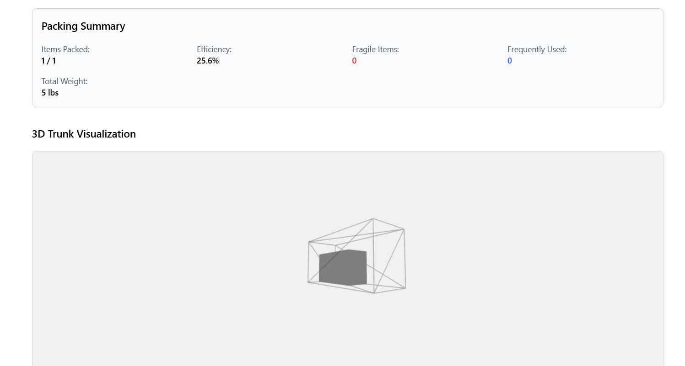

# 🚗 3D Car Trunk Packing Optimizer

A powerful 3D web-based application to optimize luggage arrangement in a car trunk. Built using **React**, **Three.js**, and intelligent heuristics to assist users in efficiently loading car trunks with various luggage constraints like size, weight, fragility, and accessibility.


---

## 🧠 Features

- 🔁 **Automatic Packing Optimization**
  - Considers luggage dimensions, weight, and properties (fragile/frequently used)
  - Ensures heavier items are at the bottom
  - Keeps fragile and frequently used items easily accessible

- 🧳 **Dynamic 3D Visualization**
  - Interactive OrbitControls to rotate and zoom the trunk
  - View exact positions and outlines for special luggage
  - Animated step-by-step packing sequence

- 📦 **Luggage Form**
  - Add custom or template bags with properties like:
    - Dimensions (L × W × H)
    - Weight
    - Fragile / Frequently Used toggles

- 🚙 **Car Model Selector**
  - Choose from predefined trunk specifications
  - Toggle seat configuration to expand trunk depth

- ⚠️ **Volume & Visibility Awareness**
  - Shows warning if total luggage volume exceeds trunk capacity
  - Maintains rear-view mirror line-of-sight for safety

---

## 📸 Screenshots

| Landing Page | Trunk Visualization |
|--------------|---------------------|
|  |  |

---

## 🛠️ Tech Stack

- **React + Tailwind CSS**
- **Three.js (@react-three/fiber, drei)**
- **JavaScript (ES6+)**
- **React Router**

---

## 🚀 Getting Started

### 1. Clone the repo

```bash
git clone https://github.com/GuhaPranav09/car-trunk-packing.git
cd car-trunk-packing
```

### 2. Install dependencies

```bash
npm install
```

### 3. Run locally

```bash
npm run dev   # For Vite
# OR
npm start     # For CRA
```

---

## 🌐 Deployment

This app is deployed on [Vercel](https://car-trunk-packing.vercel.app/) .


---

## 🧑‍💻 Team Autobots

- Guha Pranav Yelchuru  
- Ramakrishnan S  
- Karthik V  
- Kushagra Singh Gaur  

---

## 📄 License

MIT License

---

